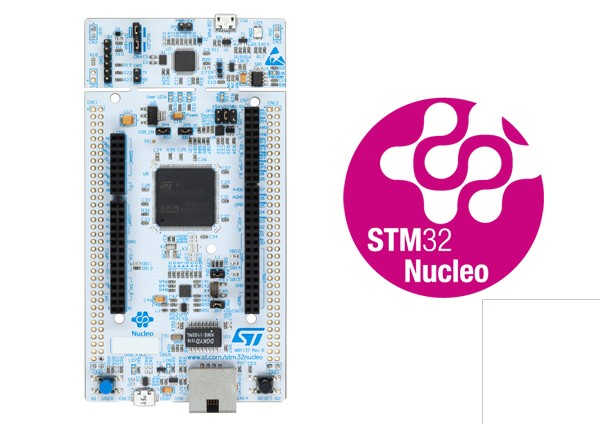

## STM NUCLEO144 F746ZG board

[Product page](http://www.st.com/en/evaluation-tools/nucleo-f746zg.html)

The board used in this community contribution is the NUCLEO144 F746ZG board from STM. The board can be purchased from various sources and should be about 23 euros. Further information on this board and links for the user and programming manuals can be found at the product page in ST [website](http://www.st.com/en/evaluation-tools/nucleo-f746zg.html).

Some basic information abstracted from ST:

- STM32 microcontroller in LQFP144 package 
- External SMPS to generate Vcore logic supply (only available on '-P' suffixed boards)
- Ethernet compliant with IEEE-802.3-2002 (depending on STM32 support)
- USB OTG or full-speed device (depending on STM32 support)
- 3 user LEDs
-2 user and reset push-buttons
- 32.768 kHz crystal oscillator
- Board connectors:
  - USB with Micro-AB
  - SWD
  - Ethernet RJ45 (depending on STM32 support)
  - ST Zio connector including Arduino™ Uno V3
  - ST morpho
- Flexible power-supply options: ST-LINK USB VBUS or external sources
- On-board ST-LINK/V2-1 debugger/programmer with USB re-enumeration capability: mass storage, virtual COM port and debug port

## Flashing and debugging

This board has two micro USB connectors. One is exposing the embedded ST-Link interface that is used for flashing the nanoFramework firmware and for performing debugging on the nanoCLR code. The second is used to connect the device with Visual Studio allowing to deploy and debug your C# managed applications.

## Floating point

The current build is set to add support for single-precision floating point.
Meaning that `System.Math` API supports only the `float` overloads. The `double` ones will throw a `NotImplementedException`.

## Firmware images (ready to deploy)

## Managed helpers

Checkout the [C# managed helpers](https://github.com/nanoframework/nf-Community-Targets/tree/main/ChibiOS/ST_NUCLEO144_F746ZG/managed_helpers) available for this board.